# FlowCheck MCP Server

<div align="center">

**🛡️ Production-Grade Safety Layer for AI-First Development**

_Git hygiene monitoring + Security scanning + Semantic search + Full observability_

[](LICENSE)
[](https://www.python.org/downloads/)
[](https://modelcontextprotocol.io/)

</div>

---

## Why FlowCheck?

AI coding assistants are incredibly productive—but they can also create **massive, hard-to-review changesets** and **security risks**. FlowCheck v0.1 is a production-grade safety layer that:

- 🔍 **Monitors Git state** in real-time during AI-assisted coding
- 🔒 **Scans for security issues** (PII, secrets, prompt injection attacks)
- 🔎 **Semantic history search** - find commits by meaning, not keywords
- 📊 **Tracks flow health** (time, lines, branch age, drift from main)
- 📝 **Full observability** (OpenTelemetry traces, audit logs)
- 🎯 **Intent validation** (ticket-to-diff alignment)
- 🤖 **Designed for AI agents** with enforceable rules

> Think of FlowCheck as a "smart fitness watch with a biometric lock" for your codebase—it helps you code faster while actively defending against security threats.

## AI-First Design

FlowCheck is built specifically for the **agentic coding** workflow:

```mermaid
flowchart LR
    Agent["🤖 AI Agent<br/>(Claude, Cursor, etc)"]
    FC["🛡️ FlowCheck<br/>MCP Server"]
    Git["📁 Git Repo<br/>(.git)"]

    Agent -->|"get_flow_state()"| FC
    FC -->|"analyze"| Git
    Git -->|"metrics"| FC
    FC -->|"status: warning<br/>security_flags: [...]"| Agent

    Agent -->|"⏸️ Pause & suggest<br/>checkpoint commit"| Agent
```



### Agent Rules (Recommended)

Copy [`rules/flowcheck-rules.md`](rules/flowcheck-rules.md) to your AI tool's rules directory:

```bash
# For Cursor
cp rules/flowcheck-rules.md .cursor/rules/

# For Claude Projects
cp rules/flowcheck-rules.md .claude/rules/

# For other tools
cp rules/flowcheck-rules.md .agent/rules/
```

This instructs AI agents to **automatically check Git hygiene** before starting tasks and to pause when thresholds are exceeded.

## Quick Start

### Installation

```bash
git clone https://github.com/your-org/flowcheck.git
cd flowcheck

python3 -m venv .venv
source .venv/bin/activate
pip install -e .
```

### Claude Desktop Integration

Add to `~/Library/Application Support/Claude/claude_desktop_config.json`:

```json
{
  "mcpServers": {
    "flowcheck": {
      "command": "/path/to/flowcheck/.venv/bin/python",
      "args": ["-m", "flowcheck.server"],
      "env": {
        "PYTHONPATH": "/path/to/flowcheck/src"
      }
    }
  }
}
```

## MCP Tools

### Core Tools

| Tool                  | Purpose                                              |
| --------------------- | ---------------------------------------------------- |
| `get_flow_state`      | Returns metrics + **security_flags** (PII/injection) |
| `get_recommendations` | Returns actionable nudges + **security warnings**    |
| `set_rules`           | Dynamically adjust thresholds                        |

### v0.1 Production Features

| Tool               | Purpose                                              |
| ------------------ | ---------------------------------------------------- |
| `search_history`   | **Semantic search** - find commits by meaning        |
| `verify_intent`    | **Ticket alignment** - validate against requirements |
| `sanitize_content` | **PII/secret redaction** before sharing with AI      |

### Example: `get_flow_state`

```json
{
  "minutes_since_last_commit": 45,
  "uncommitted_lines": 520,
  "uncommitted_files": 8,
  "branch_name": "feature/api-refactor",
  "branch_age_days": 3,
  "behind_main_by_commits": 12,
  "status": "warning",
  "security_flags": ["⚠️ SECRETS: Potential secrets detected in diff"]
}
```

### Example: `get_recommendations`

```json
{
  "recommendations": [
    "🔒 SECURITY: Review security flags before committing.",
    "📊 You have 520 uncommitted lines. Consider splitting into focused commits.",
    "🔄 You are behind main by 12 commits. Consider merging to avoid conflicts."
  ],
  "status": "warning",
  "security_flags": ["⚠️ SECRETS: Potential secrets detected in diff"]
}
```

### Example: `search_history`

```json
{
  "query": "authentication changes",
  "results": [
    {
      "commit_hash": "a1b2c3d",
      "message": "Refactor OAuth token validation",
      "score": 0.87,
      "matched_terms": ["oauth", "token"]
    }
  ]
}
```

## Configuration

FlowCheck uses `~/.flowcheck/config.json`:

```json
{
  "max_minutes_without_commit": 60,
  "max_lines_uncommitted": 500
}
```

| Parameter                    | Default | Description                          |
| ---------------------------- | ------- | ------------------------------------ |
| `max_minutes_without_commit` | 60      | Minutes before suggesting checkpoint |
| `max_lines_uncommitted`      | 500     | Lines before suggesting split        |

## Status Levels

| Status    | Meaning                             |
| --------- | ----------------------------------- |
| `ok`      | All metrics within thresholds       |
| `warning` | One or more thresholds exceeded     |
| `danger`  | Thresholds exceeded by 1.5x or more |

## Security Features (v0.1)

### Guardian Layer

- **PII Detection**: Emails, phone numbers, SSNs, credit cards
- **Secret Scanning**: AWS keys, GitHub tokens, API keys, passwords
- **Injection Filtering**: Detects prompt injection attacks in diffs

### Observability

- **OpenTelemetry Traces**: `gen_ai.*` semantic conventions
- **Audit Logs**: Append-only JSON Lines format in `~/.flowcheck/audit.log`
- All tool invocations are logged with trace IDs

### Semantic Search

- **TF-IDF Vectorization**: No external ML dependencies
- **SQLite Storage**: Local index in `~/.flowcheck/semantic_index.db`
- Find commits by meaning, not just keywords

## Development

```bash
# Run tests
pytest tests/ -v

# Run with coverage
pytest tests/ --cov=src/flowcheck
```

## Philosophy

FlowCheck embodies the principle that **good Git hygiene enables good AI collaboration**:

1. **Smaller commits** are easier for humans to review and audit
2. **Frequent checkpoints** prevent losing work during long sessions
3. **Clean history** makes it easier to understand what the AI changed
4. **Non-blocking nudges** preserve developer autonomy

## License

MIT
