# FlowCheck MCP Server

<div align="center">

**🛡️ Production-Grade Safety Layer for AI-First Development**

_Git hygiene monitoring + Security scanning + Semantic search + Full observability_

[](LICENSE)
[](https://www.python.org/downloads/)
[](https://modelcontextprotocol.io/)

</div>

---

## Why FlowCheck?

AI coding assistants are incredibly productive—but they can also create **massive, hard-to-review changesets** and **security risks**. FlowCheck is a production-grade safety layer that:

- 🔍 **Monitors Git state** in real-time during AI-assisted coding
- 🔒 **Scans for security issues** (PII, secrets, prompt injection attacks)
- 🔎 **Semantic history search** - find commits by meaning, not keywords
- 📊 **Tracks flow health** (time, lines, branch age, drift from main)
- 📝 **Full observability** (OpenTelemetry traces, audit logs)
- 🎯 **Intent validation** (ticket-to-diff alignment)
- 🤖 **Designed for AI agents** with enforceable rules

> Think of FlowCheck as a "smart fitness watch with a biometric lock" for your codebase—it helps you code faster while actively defending against security threats.

## AI-First Design

FlowCheck is built specifically for the **agentic coding** workflow:

```mermaid
flowchart LR
    Agent["🤖 AI Agent<br/>(Claude, Cursor, etc)"]
    FC["🛡️ FlowCheck<br/>MCP Server"]
    Git["📁 Git Repo<br/>(.git)"]

    Agent -->|"get_flow_state()"| FC
    FC -->|"analyze"| Git
    Git -->|"metrics"| FC
    FC -->|"status: warning<br/>security_flags: [...]"| Agent

    Agent -->|"⏸️ Pause & suggest<br/>checkpoint commit"| Agent
```



### Agent Rules (Recommended)

Copy [`rules/flowcheck-rules.md`](rules/flowcheck-rules.md) to your AI tool's rules directory:

```bash
# For Cursor
cp rules/flowcheck-rules.md .cursor/rules/

# For Claude Projects
cp rules/flowcheck-rules.md .claude/rules/

# For other tools
cp rules/flowcheck-rules.md .agent/rules/
```

This instructs AI agents to **automatically check Git hygiene** before starting tasks and to pause when thresholds are exceeded.

## Quick Start

### Installation

```bash
git clone https://github.com/backslash-ux/flowcheck.git
cd flowcheck

python3 -m venv .venv
source .venv/bin/activate
pip install -e .
```

### Claude Desktop Integration

Add to `~/Library/Application Support/Claude/claude_desktop_config.json`:

```json
{
  "mcpServers": {
    "flowcheck": {
      "command": "/path/to/flowcheck/.venv/bin/python",
      "args": ["-m", "flowcheck.server"],
      "env": {
        "PYTHONPATH": "/path/to/flowcheck/src"
      }
    }
  }
}
```

## MCP Tools

### Core Tools

| Tool                  | Purpose                                              |
| --------------------- | ---------------------------------------------------- |
| `get_flow_state`      | Returns metrics + **security_flags** (PII/injection) |
| `get_recommendations` | Returns actionable nudges + **security warnings**    |
| `set_rules`           | Dynamically adjust thresholds                        |

### v0.2 Smart Features (New)

| Tool               | Purpose                                                                               |
| ------------------ | ------------------------------------------------------------------------------------- |
| `search_history`   | **Semantic search** - find commits by meaning                                         |
| `verify_intent`    | **Smart Intent Verification** - use "AI Judge" (BYOK LLM) to align diffs with tickets |
| `sanitize_content` | **PII/secret redaction** before sharing with AI                                       |

### Example: `verify_intent` (Smart Mode)

```json
{
  "alignment_score": 0.4,
  "is_aligned": false,
  "ticket_id": "42",
  "scope_creep_warnings": ["Scope Creep Detected by AI Judge"],
  "reasoning": "The ticket asks for a bug fix in auth, but the diff contains a full refactor of the billing module."
}
```

## Configuration

FlowCheck supports hierarchical configuration:

1. **Repo Config**: `.flowcheck.json` (in project root)
2. **Global Config**: `~/.flowcheck/config.json`
3. **Defaults**

### `.flowcheck.json` Example

```json
{
  "max_minutes_without_commit": 45,
  "intent": {
    "provider": "openai",
    "model": "gpt-4o",
    "api_key_env": "OPENAI_API_KEY"
  }
}
```

### Ignoring Files (`.flowcheckignore`)

Create a `.flowcheckignore` file in your repo root to exclude files from analysis (uses gitignore syntax):

```gitignore
tests/fixtures/
*.min.js
legacy/
```

## Security Features

### Guardian Layer

- **PII Detection**: Emails, phone numbers, SSNs, credit cards
- **Secret Scanning**: AWS keys, GitHub tokens, API keys, passwords
- **Injection Filtering**: Detects prompt injection attacks in diffs

### Observability

- **OpenTelemetry Traces**: `gen_ai.*` semantic conventions
- **Audit Logs**: Append-only JSON Lines format in `~/.flowcheck/audit.log`
- All tool invocations are logged with trace IDs

### Semantic Search

- **TF-IDF Vectorization**: No external ML dependencies
- **SQLite Storage**: Local index in `~/.flowcheck/semantic_index.db`
- Find commits by meaning, not just keywords

## Installation & Deployment

### Option 1: Docker (Recommended)

Get FlowCheck running in 30 seconds:

```bash
# Clone and setup
git clone https://github.com/backslash-ux/flowcheck.git
cd flowcheck

# Configure environment
cp .env.example .env
nano .env  # Add your API keys

# Start the stack
docker-compose up
```

FlowCheck is now running at `http://localhost:8000`

**See [Docker Deployment Guide](docs/deployment/Docker.md) for:**
- Local development setup
- Production deployment
- Image variants (production/slim/dev)
- Troubleshooting

### Option 2: Python Package

```bash
pip install git+https://github.com/backslash-ux/flowcheck.git

# Set environment variables
export ANTHROPIC_API_KEY=sk-ant-xxxxx

# Start server
flowcheck-server
```

### Option 3: From Source

```bash
git clone https://github.com/backslash-ux/flowcheck.git
cd flowcheck

# Create virtual environment
python3 -m venv .venv
source .venv/bin/activate

# Install in development mode
pip install -e ".[dev]"

# Run tests
pytest tests/

# Start server
flowcheck-server
```

## Deployment

FlowCheck supports multiple deployment models:

| Scenario | Time | Guide |
|----------|------|-------|
| **Local Development** | 5 min | [Docker](docs/deployment/Docker.md) |
| **Production (Docker)** | 10 min | [Docker.md](docs/deployment/Docker.md#production-deployment) |
| **Kubernetes** | 30 min | [Kubernetes.md](docs/deployment/Kubernetes.md) |
| **CI/CD Integration** | 15 min | [CI-CD.md](docs/deployment/CI-CD.md) |

👉 **[Deployment Guide](docs/deployment/README.md)** for full options

## Development

```bash
# Setup development environment
docker-compose -f docker-compose.dev.yml up

# Or use Python venv
python3 -m venv .venv
source .venv/bin/activate
pip install -e ".[dev]"

# Run tests
pytest tests/ -v

# Run with coverage
pytest tests/ --cov=src/flowcheck
```

## Philosophy

FlowCheck embodies the principle that **good Git hygiene enables good AI collaboration**:

1. **Smaller commits** are easier for humans to review and audit
2. **Frequent checkpoints** prevent losing work during long sessions
3. **Clean history** makes it easier to understand what the AI changed
4. **Non-blocking nudges** preserve developer autonomy

## License

MIT
